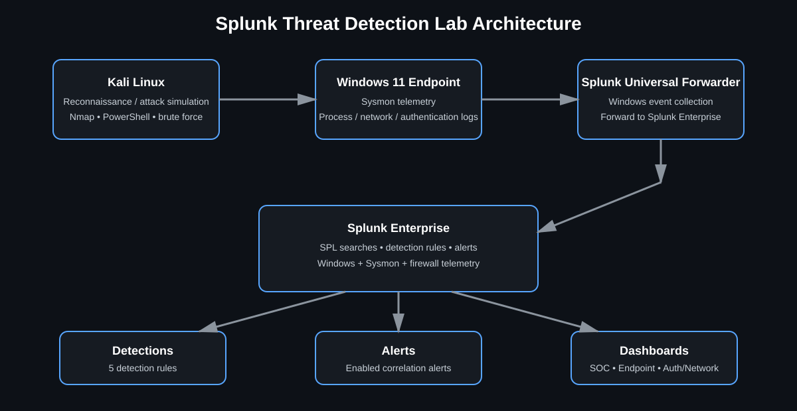

# Threat Detection & Incident Response Using Splunk Enterprise

I built this lab to practice the day-to-day parts of a SOC role with Splunk: collecting endpoint logs, writing SPL searches, testing detections, creating alerts, and investigating the results.

The lab uses Ubuntu Server for Splunk Enterprise, Windows 11 as the main monitored endpoint, Sysmon for process telemetry, a Splunk Universal Forwarder for log collection, and Kali Linux for controlled testing.

## Lab Environment

- **Splunk Enterprise** - Ubuntu Server 24.04.4 LTS
- **Windows 11 Pro** - monitored endpoint
- **Microsoft Sysmon v15.21** - process and endpoint telemetry
- **Splunk Universal Forwarder** - log forwarding
- **Kali Linux** - controlled attack simulation

The main data sources are Windows Security events, Sysmon events, and Windows Firewall logs.

## Architecture



```text
Kali Linux
    |
    | Controlled attack activity
    v
Windows 11 + Sysmon + Windows Firewall
    |
    | Splunk Universal Forwarder
    v
Splunk Enterprise on Ubuntu
    |
    +--> SPL searches
    +--> Alerts
    +--> Dashboards
    +--> Investigation
```

Kali was used to generate test activity, while the Windows endpoint produced the telemetry that was forwarded to Splunk.

[Architecture details](architecture/README.md)

## Detection Tests

I tested five main scenarios:

| Detection | What I tested | ATT&CK |
|---|---|---|
| PowerShell execution | PowerShell process creation | T1059.001 - PowerShell |
| Encoded PowerShell | PowerShell started with `-enc` / `-EncodedCommand` | T1059.001 - PowerShell |
| Parent-child process | Process relationships such as `cmd.exe` spawning `powershell.exe` | T1204 - User Execution* |
| Windows brute force | Repeated failed logons using Event ID 4625 | T1110 - Brute Force |
| TCP port scan | Nmap traffic in Windows Firewall logs | T1046 - Network Service Discovery |

*The mapping follows the original lab documentation. The process relationship itself is treated as an investigation signal, not proof of malicious activity.

## SPL and Evidence

Each detection has its SPL search, notes, and screenshot in the repository.

| Detection | SPL | Notes | Screenshot |
|---|---|---|---|
| PowerShell execution | [SPL](spl/powershell-execution.spl) | [Notes](detections/powershell-execution.md) | [Screenshot](screenshots/powershell-execution.png) |
| Encoded PowerShell | [SPL](spl/encoded-powershell.spl) | [Notes](detections/encoded-powershell.md) | [Screenshot](screenshots/encoded-powershell.png) |
| Parent-child process | [SPL](spl/parent-child-process.spl) | [Notes](detections/parent-child-process.md) | [Screenshot](screenshots/parent-child-process.png) |
| Windows brute force | [SPL](spl/windows-bruteforce.spl) | [Notes](detections/windows-bruteforce.md) | [Screenshot](screenshots/windows-bruteforce.png) |
| TCP port scan | [SPL](spl/tcp-port-scan.spl) | [Notes](detections/tcp-port-scan.md) | [Screenshot](screenshots/tcp-port-scan.png) |

## Windows Brute-Force Detection

For failed-logon testing I used Windows Event ID 4625. The search groups failures by source IP and flags a source after at least five failed attempts.

```spl
index=* EventCode=4625
| eval Source_IP=coalesce(Source_Network_Address, SourceIp, IpAddress)
| stats count AS failed_attempts values(Account_Name) AS targeted_accounts by Source_IP
| where failed_attempts >= 5
| sort - failed_attempts
```

The result shows the source IP, number of failed attempts, and targeted accounts. Before calling it a real brute-force incident, I would check the source, timing, account context, and related successful logons.

## PowerShell Investigation

Sysmon Event ID 1 records process creation. I used SPL to extract the executable and command line so I could review how PowerShell was started.

```spl
source="WinEventLog:Microsoft-Windows-Sysmon/Operational"
EventCode=1
| rex field=_raw "<Data Name='Image'>(?<Image>[^<]+)</Data>"
| rex field=_raw "<Data Name='CommandLine'>(?<CommandLine>[^<]*)</Data>"
| search Image="*powershell.exe"
| table _time Computer User Image CommandLine
| sort -_time
```

For an encoded PowerShell event, I would review the command line, decode the Base64 content where appropriate, check the parent process, and look for related network activity.

## TCP Port-Scan Detection

For the network test I ran a TCP SYN scan from Kali against the Windows endpoint:

```bash
nmap -sS <WINDOWS_IP>
```

The Windows Firewall log was collected from:

```text
C:\Windows\System32\LogFiles\Firewall\pfirewall.log
```

The SPL extracts the network fields, counts distinct destination ports by source IP, and flags a source that reaches at least three different TCP ports.

[View the SPL](spl/tcp-port-scan.spl)

## Dashboards

I built three dashboard views:

- **SOC Executive Dashboard** - high-level endpoint, authentication, and network activity.
- **Endpoint Detection Dashboard** - PowerShell and process-related detections.
- **Authentication & Network Security Dashboard** - failed logons, successful logons, network connections, and port-scan activity.

[View dashboard details](dashboards/README.md)

## Troubleshooting

A few setup problems were part of the project:

- Fixed Splunk Universal Forwarder connectivity to the Splunk server.
- Checked the receiving port and firewall settings when events were not arriving.
- Fixed Windows Firewall log parsing with `rex` field extraction.
- Standardized on `EventCode` for the searches used in the lab.
- Re-ran the controlled tests after correcting the searches and ingestion settings.

## Scope

This is a lab environment. The alerts and thresholds were created for testing and learning, not for direct production deployment. A production setup would need baseline tuning, more context, and a defined incident-response process.

## Future Work

- Add more detailed Sysmon coverage.
- Add approved threat-intelligence enrichment.
- Create more detections and document false-positive tuning.
- Test controlled response actions after the detections are stable.

## Project Report

[Open the complete Splunk project report](reports/Splunk-Threat-Detection-Incident-Response-Report.pdf)

## Repository Structure

```text
.
├── architecture/
├── comparison/
├── dashboards/
├── detections/
├── reports/
├── screenshots/
├── spl/
└── README.md
```

## Author

**Ibrahim Khaleel**
