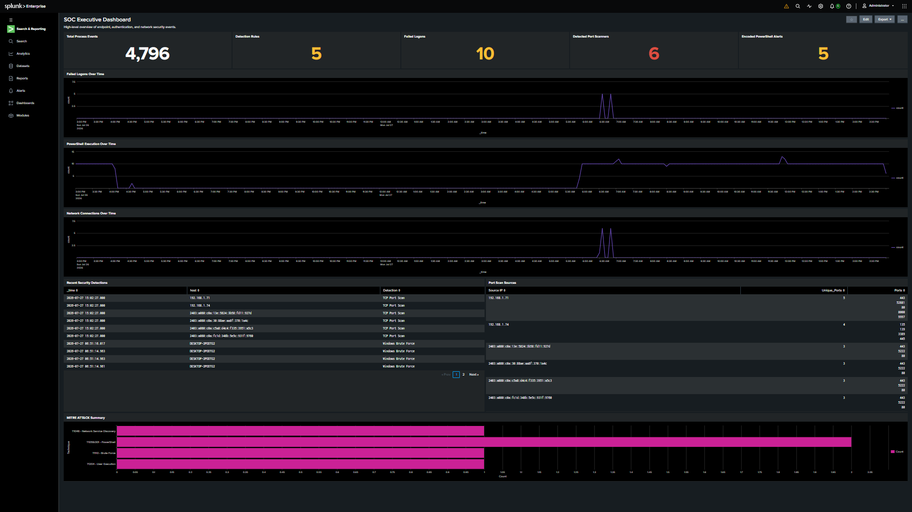
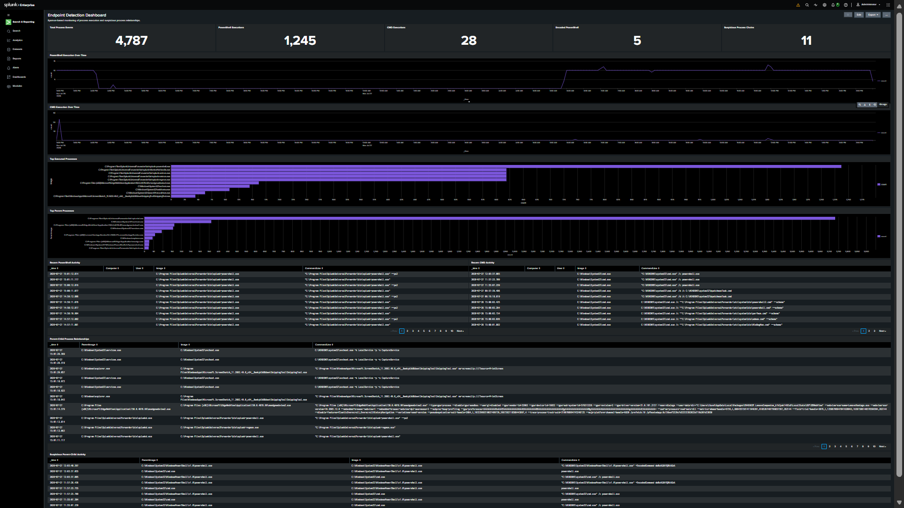
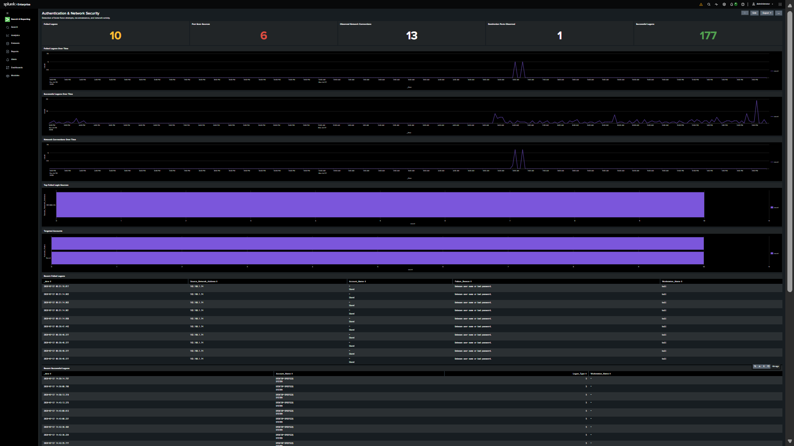

# Splunk Dashboards

The laboratory includes three analyst-facing dashboard views built in Splunk Enterprise.

## 1. SOC Executive Dashboard

High-level view of endpoint, authentication, and network detections.

## 2. Endpoint Detection Dashboard

Focuses on process execution, PowerShell activity, encoded PowerShell, and suspicious process relationships.

## 3. Authentication & Network Security Dashboard

Focuses on failed/successful authentication activity, network connections, and port-scan observations.

## Dashboard Inventory Evidence

The Splunk dashboard inventory is captured in [dashboards-list.png](../screenshots/dashboards-list.png).

## Design Notes

- Dashboards are intended for SOC triage and investigation.
- Detection panels are backed by SPL searches.
- Visual evidence is stored separately under `screenshots/`.
- No credentials, API keys, or tokens are stored in this repository.
